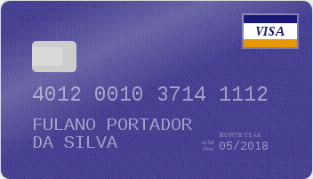

# Números dos cartões e validação

Seja por curiosidade, seja por necessidade, você já deve ter se perguntado sobre como é definido o número de um cartão de crédito. Algumas pessoas chegam a achar que são números aleatórios, ou sequênciais, atribuídos pelas bandeiras ou pelos bancos emissores, mas a realidade é que o número do cartão segue um padrão especificado e que é possível saber qual é a bandeira, tipo do cartão e a conta do portador, apenas observando o número do cartão; em alguns casos, de fato, é possível saber até o país de origem do cartão, apenas observando seu número.

Com o objetivo de contribuir para a redução as transações negadas pelo código 14 – cartão inválido, a Cielo recomenda o uso do algoritmo de Luhn para verificação da sequência de números dos cartões de credito e débito utilizados na sua loja. Esse tutorial descreve como se dá o algoritmo Luhn e também lista os BINs das bandeiras, para contribuir ainda mais com a diminuição das negativas por código 14.

## Dissecando o número do cartão



Basicamente, o número do cartão é composto por três partes:

1. Bin ou Inn - Bank identification number, ou Issuer identification number, é o número que identifica o banco emissor; Visa, Mastercard, Amex, etc, cada um desses emissores são identificados através dos primeiros dígitos do cartão. No caso do cartão de exemplo acima, o Bin é 4, que é o identificador da Visa.
2. Conta do cliente - Após o bin, os próximos dígitos identificam o número da conta do portador no banco emissor. Logo após o Bin, os próximos 14 dúgitos são o identificador da conta do cliente: **012 0010 3714 111**.
3. Dígito de verificação - Esse último dígito é utilizado para verificar se o número do cartão de crédito é válido. Para se chegar no dígito verificador é utilizado um algorítimo chamado Luhn. No caso do cartão de exemplo acima, o dígito verificador é **2**.

# Validação do número do cartão

## Validação dos números do cartão

A validação do número de cartão da maioria das bandeiras em todo o mundo é feita através de um algorítimo chamado Luhn, também conhecido como módulo 10. Vamos supor que o cliente tenha informado o seguinte número de cartão de crédito: 4012001037141112.

O primeiro passo é remover temporariamente o último dígito, no caso o dígito 2. O novo número vai ficar assim: 401200103714111.

|Posição| 0 | 1 | 2 | 3 | 4 | 5 | 6 | 7 | 8 | 9 | 10 | 11 | 12 | 13 | 14 | 15 |
|----------------|---|---|---|---|---|---|---|---|---|---|---|---|---|---|---|---|
|Número do cartão|4|0|1|2|0|0|1|0|3|7|1|4|1|1|1|*x*|

O segundo passo é multiplicar, iniciando do primeiro dígito, todos os dígitos que estão em posição par por 2 e todos os dígitos em posição impar por 1:

|Posição| 0 | 1 | 2 | 3 | 4 | 5 | 6 | 7 | 8 | 9 | 10 | 11 | 12 | 13 | 14 | 15 |
|----------------|---|---|---|---|---|---|---|---|---|---|---|---|---|---|---|---|
|Número do cartão| 4 | 0 | 1 | 2 | 0 | 0 | 1 | 0 | 3 | 7 | 1 | 4 | 1 | 1 | 1 | - |
|Multiplicações|x2|x1|x2|x1|x2|x1|x2|x1|x2|x1|x2|x1|x2|x1|x2||-|
|Resultados|8|0|2|2|0|0|2|0|6|7|2|4|2|1|2||-|

O terceiro passo é pegar os resultados das multiplicações e somar todos os dígitos:

|Dígitos|Cálculo|Resultado|
|-------|-------|---------|
|802200206724212|8+0+2+2+0+0+2+0+6+7+2+4+2+1+2|38|

O quarto passo é obter o resto da divisão euclidiana do resultado do terceiro passo por 10: 38 / 10 = 3, com resto 8. O quinto passo é subtrair o resto de 10: 10 - 8 = 2

|Cálculo IV|Quociente|Resto|Cálculo V|Resultado|
|----------|---------|-----|---------|---------|
|38/10|3|8|10-8|2|

O número 2 é o dígito de verificação. Para verificar se o número do cartão informado pelo cliente é válido, basta verificar o número do primeiro passo + o dígito de verificação é igual ao número de cartão informado pelo cliente.

Um outro exemplo do cálculo, dessa vez com um cartão Martercard:

|Cartão| 5 | 4 | 5 | 3 | 0 | 1 | 0 | 0 | 0 | 0 | 0 | 6 | 6 | 1 | 6 | 7 |Resultado|
|------|---|---|---|---|---|---|---|---|---|---|---|---|---|---|---|---|---------|
|Passo 1|5|4|5|3|0|1|0|0|0|0|0|6|6|1|6|||
|Passo 2|10|4|10|3|0|1|0|0|0|0|0|6|12|1|12|||
|Passo 3|1+0|4|1+0|3|0|1|0|0|0|0|0|6|1+2|1|1+2||23|
|Passo 4||||||||||||||||23%10|3|
|Passo 5||||||||||||||||10-3|**7**|

## Validação da bandeira

Após validar que o número do cartão é válido através do dígito verificador obtido através do algoritmo Luhn, podemos verificar se a bandeira está correta apenas verificando o BIN. Por exemplo, no primeiro exemplo de cálculo utilizamos o cartão 4012001037141112; como o cartão começa com o dígito 4, sabemos que esse cartão é um cartão Visa válido. O mesmo para o segundo exemplo, o segundo cartão que validamos acima foi o cartão 5453010000066167; como ele inicia em 54, sabemos que é um cartão Mastercard válido.

A tabela abaixo lista os BINs das bandeiras e pode ser utilizada para verificar o cartão está correto segundo o emissor do cartão:

|Bandeira|Bin|Número de dígitos|Dígitos do CVV|
|--------|---|-----------------|--------------|
|Visa|4|13 ou 16 dígitos|3 dígitos|
|Mastercard|51 à 55|16 dígitos|3 dígitos|
|Amex|<ul><li>34</li><li>37</li></ul>|15 dígitos|4 dígitos|
|Diners Club International|<ul><li>300 à 305</li><li>309</li><li>36</li><li>38 à 39</li></ul>|14 dígitos|3 dígitos|
|JCB|3528 à 3589|16 dígitos|3 dígitos|
|ELO|<ul><li>401178</li><li>401179</li><li>431274</li><li>438935</li><li>451416</li><li>457393</li><li>457631</li><li>457632</li><li>504175</li><li>506699 à 506778</li><li>509000 à 509999</li><li>627780</li><li>636297</li><li>636368</li><li>650031 à 650033</li><li>650035 à 650051</li><li>650405 à 650439</li><li>650485 à 650538</li><li>650541 à 650598</li><li>650700 à 650718</li><li>650720 à 650727</li><li>650901 à 650920</li><li>651652 à 651679</li><li>655000 à 655019</li><li>655021 à 655058</li></ul>|16 dígitos|3 dígitos|

# Evitando erros na integração

Um erro muito comum que ocorre nas integrações, é o erro 14 - cartão inválido. Esse tipo de erro é causado, normalmente, por erro de digitação do cliente, mas pode ser facilmente evitado apenas seguindo duas recomendações:

1. Sempre faça a verificação do número do cartão no frontend, de forma visual para o cliente.
2. Sempre faça a validação no backend antes de fazer a integração com a Cielo.

Validando o cartão utilizando o algoritmo Luhn para validar o número do cartão, como descrito anteriormente, é a forma mais eficiente para evitar o erro 14 e melhorar a experiência de compra do cliente da loja.

## Verificação no frontend

Para evitar que o cliente digite o número do cartão de forma errada e a loja receba um erro durante a integração, a recomendação é uma verificação dupla do número do cartão. A primeira verificação deve ocorrer no browser do cliente e a loja pode utilizar alguns plugins para isso. O exemplo abaixo utiliza o seguinte plugin: [jessepollak/card](https://github.com/jessepollak/card)

<div class="demo-container">
    <div class="card-wrapper"></div>

    <div class="form-container active">
        <form action="">
            <input placeholder="Card number" type="text" name="number">
            <input placeholder="Full name" type="text" name="name">
            <input placeholder="MM/YY" type="text" name="expiry">
            <input placeholder="CVC" type="text" name="cvc">
        </form>
    </div>
</div>

## Validação no backend

Porém, mesmo tendo o plugin verificador no frontend, é fundamental, até por considerações de segurança, que uma validação de fato ocorra no backend. Para isso, a função abaixo irá ajudá-lo a fazer essa validação:

```php
<?php
function cardIsValid($cardNumber)
{
    $number = substr($cardNumber, 0, -1);
    $doubles = [];

    for ($i = 0, $t = strlen($number); $i < $t; ++$i) {
        $doubles[] = substr($number, $i, 1) * ($i % 2 == 0? 2: 1);
    }

    $sum = 0;

    foreach ($doubles as $double) {
        for ($i = 0, $t = strlen($double); $i < $t; ++$i) {
            $sum += (int) substr($double, $i, 1);
        }
    }

    return substr($cardNumber, -1, 1) == (10-$sum%10);
}
```

Para utilizá-la, basta testar o número do cartão enviado pelo cliente:

```php
if (cardIsValid($customerCardNumber)) {
  // o cartão é válido e podemos dar andamento na integração
}
``
